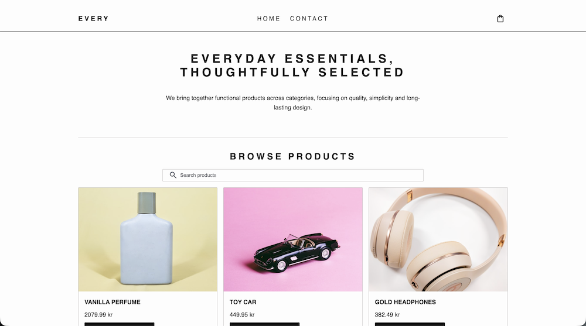

## JavaScript Frameworks Course Assignment

## _EVERY_



## :books: Description

This is my delivery for **JavaScript Frameworks Course Assignment** at Noroff. The task was to apply the skills learned in the JavaScript Frameworks course and create an e-commerce website with the provided API.

### :sparkles: Features

- Product listing with lookahead search
- Individual product pages with reviews and discounts
- Shopping cart with total calculation
- Checkout flow with success page
- Contact form with validation
- Client-side routing with React Router

<br><br>

## :globe_with_meridians: API

This project uses the [Noroff API V2](https://docs.noroff.dev/docs/v2/basic/online-shop) for the online-shop functionality.

<br><br>

## :rocket: Live Version

[EVERY](https://example.com)

<br><br>

## :computer: Testing

If you want to test site, you can visit the live version. Please note that for the contact form these requirements must be fulfilled

- Name must be 3 or more characters
- E-mail must be a valid email address
- Subject must be 3 or more characters
- Message must be 3 or more characters

<br><br>

## :handshake: Contribution

If you'd like to contribute, feel free to fork the repo and follow the steps under _Getting Started_.

<br><br>

## :construction_worker: Getting Started

Before you begin, make sure you have the following installed:

- [Node.js](https://nodejs.org/)
- A terminal
- Your preferred code editor

### Clone the Repository

```bash
git clone git@github.com:VildeAvloes/javascript-frameworks-ca.git

```

### Navigate to project folder

```
cd ...
```

Install dependencies

```
npm install
```

## Usage

When installed you can use the following commands to run the application

**Start:** Launches the application in web browser and watch for changes.

```
npm run start
```

**Build:** Builds the application for production

```
npm run build
```

**Format:** Formats files using Prettier

```
npm run format
```

<br><br>

## :wrench: Technologies Used

- React
- Sass (CSS Modules)
- React Router
- Prettier
- Google Material Symbols (icons)
- Netlify

<br><br>

## :page_facing_up: License

This project is open for educational use as part of Noroff's JavaScript Frameworks Course Assignment. Please contact me before reusing the code for anything outside of that.

<br><br>

## :envelope: Contact

- [My GitHub Profile](https://github.com/VildeAvloes)
- [My LinkedIn Page](https://www.linkedin.com/in/vildeavloes/)
